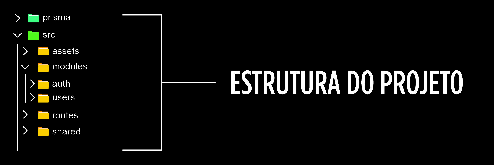

# Batuta Backend 🎵


> API backend do aplicativo **Batuta**, responsável por gerenciar dados, usuários e funcionalidades necessárias para o funcionamento do aplicativo mobile.
* O Batuta é um aplicativo gamificado para ensino de teoria musical.  
* Esta API fornece os serviços necessários para suportar as funcionalidades da aplicação mobile.
  


---

# 🎮 Sobre o projeto
Para tornar o ensino de teoria musical mais acessível e envolvente, o projeto BATUTA utiliza conceitos de **gamificação** para incentivar o aprendizado.

A API é responsável por:

- gerenciamento de dados da aplicação
- comunicação com banco de dados
- organização da lógica de negócio
- suporte às funcionalidades do aplicativo mobile

---

# 🏗 Arquitetura da API

* A API foi construída seguindo os princípios de arquitetura **RESTful**, permitindo comunicação eficiente entre o aplicativo mobile e o servidor.

* A aplicação utiliza **Express** para criação dos endpoints e **Prisma ORM** para gerenciamento e acesso ao banco de dados.

---

# 🛠 Tecnologias utilizadas
Este projeto utiliza as seguintes tecnologias:

- **Node.js**
- **TypeScript**
- **Express**
- **Prisma ORM**
- **Docker**
- **Insomnia** (testes de requisição)


---

# 📂 Estrutura do projeto

A aplicação foi organizada para facilitar manutenção e escalabilidade.



---
# 🚀 Como executar o projeto

### Pré-requisitos

- Node.js
- npm ou yarn
- Docker (opcional)

### Clonar o repositório

```bash
git clone https://github.com/werbertviana/batuta-api
```
### Entrar na pasta

```bash
cd batuta-api
```
### Instalar dependências

```bash
npm install
```
### Executar o projeto

```bash
npm run dev
```
---

# 🚀 Como executar o projeto

# 🎥 Vídeo demonstrativo do BATUTA

https://github.com/user-attachments/assets/aa1a286a-eaa3-4d26-98a6-ae738c7ffa3f

